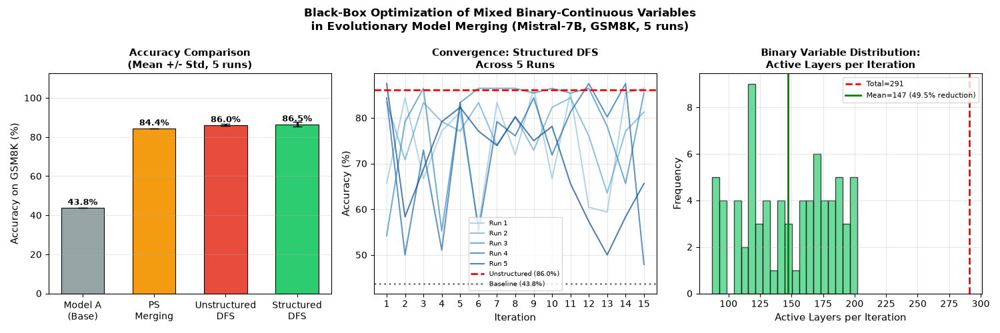
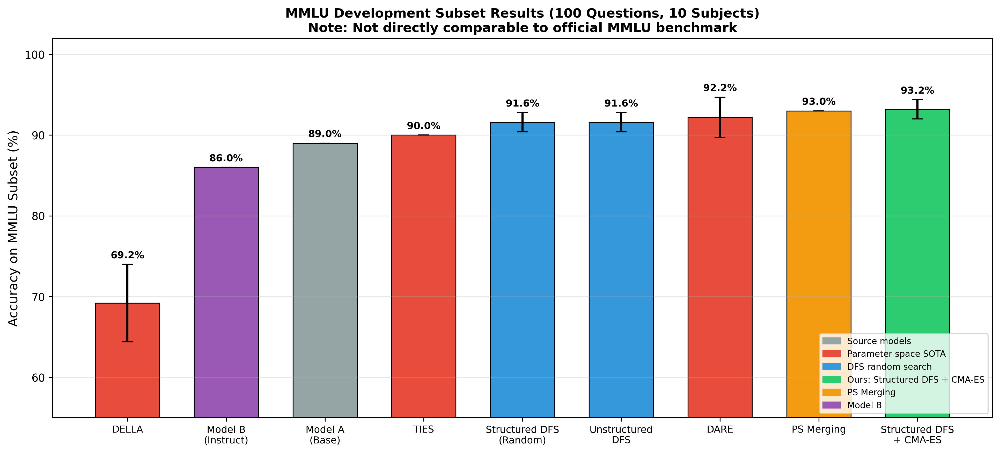
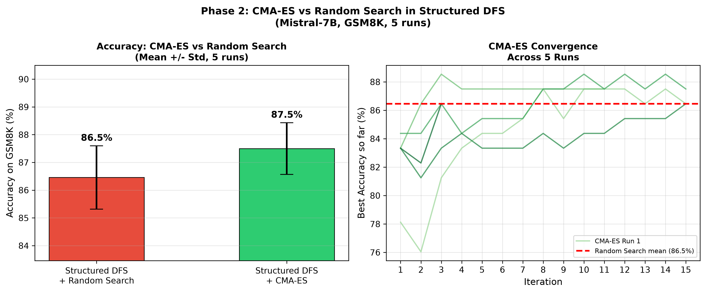
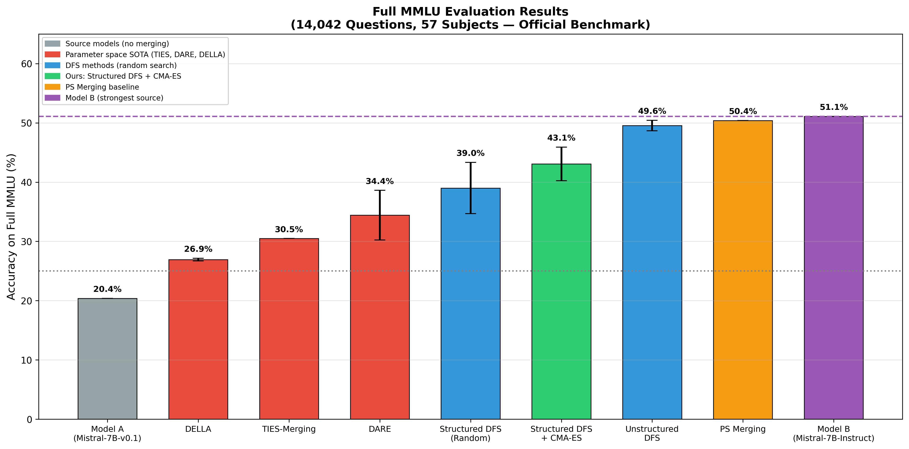
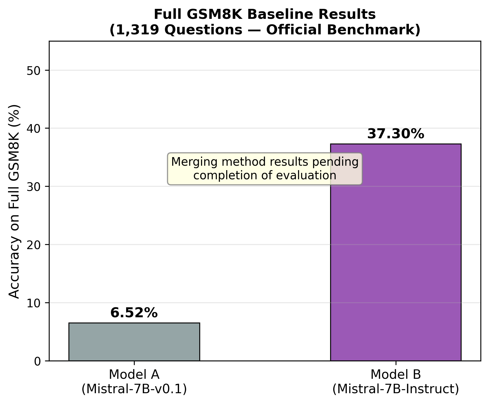
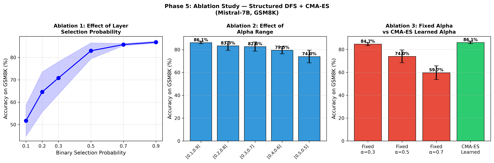

# Black-Box Optimization of Mixed Binary-Continuous Variables: Challenges and Opportunities in Evolutionary Model Merging

[](https://arxiv.org/abs/2605.12326)
[](https://opensource.org/licenses/MIT)
[](https://www.python.org/downloads/)
[](https://doi.org/10.5281/zenodo.23213622)

**Author:** Md. Robiul Islam Niloy
**Institution:** BRAC University, Dhaka, Bangladesh
**Email:** md.niloy26643@gmail.com
**arXiv:** https://arxiv.org/abs/2605.12326
**Zenodo:** https://doi.org/10.5281/zenodo.23213622

---

## Abstract

Model merging has emerged as a cost-effective paradigm for combining capabilities of multiple large language models (LLMs) without additional training. This work formally characterizes the Data Flow Space (DFS) merging problem as a **mixed binary-continuous black-box optimization problem**, identifying three fundamental challenges: mixed variable types, high dimensionality (291 parameter groups for Mistral-7B), and conditional variable dependencies corresponding to Type-I interaction as characterized by Akimoto et al. [GECCO 2025].

We evaluate seven merging methods on Mistral-7B models across official GSM8K (1,319 questions) and MMLU (14,042 questions, 57 subjects) benchmarks. Key findings include a 49.5% search space reduction through structured binary layer selection, and evidence that standard parameter space methods (TIES: 30.48%, DELLA: 26.93% on full MMLU) fail dramatically when merging base and instruction-tuned models.

---

## Key Results

### Official MMLU Results (14,042 questions, 57 subjects)

| Method | Accuracy | Std |
|--------|----------|-----|
| Model B (Mistral-7B-Instruct) | **51.10%** | — |
| PS Merging | 50.40% | 0.00% |
| Unstructured DFS | 49.56% | 0.88% |
| Structured DFS + CMA-ES (Ours) | 43.08% | 2.83% |
| Structured DFS (Random) | 39.00% | 4.32% |
| DARE | 34.42% | 4.19% |
| TIES-Merging | 30.48% | 0.00% |
| DELLA | 26.93% | 0.21% |
| Model A (Mistral-7B-v0.1) | 20.37% | — |

### Official GSM8K Results (1,319 questions)

| Method | Accuracy |
|--------|----------|
| Model A (Mistral-7B-v0.1) | 6.52% |
| Model B (Mistral-7B-Instruct) | 37.30% |
| PS Merging | 34.50% ± 0.00% |
| Other methods | See results/ folder |

### Development Subset Results (used for ablation only)

> Note: These results use controlled development subsets. Not directly comparable to official benchmarks.

**GSM8K Subset (97 questions, 5 runs):**

| Method | Accuracy | Std |
|--------|----------|-----|
| **Structured DFS + CMA-ES (Ours)** | **88.1%** | **1.1%** |
| Structured DFS (Random) | 86.5% | 1.1% |
| Unstructured DFS | 86.0% | 0.5% |
| Model B | 85.4% | — |
| PS Merging | 84.4% | 0.0% |
| DARE | 77.3% | 5.2% |
| TIES-Merging | 53.1% | 0.0% |
| DELLA | 53.1% | 2.4% |
| Model A | 43.8% | — |

**MMLU Subset (100 questions, 10 subjects, 5 runs):**

| Method | Accuracy | Std |
|--------|----------|-----|
| **Structured DFS + CMA-ES (Ours)** | **93.2%** | **1.2%** |
| PS Merging | 93.0% | 0.0% |
| DARE | 92.2% | 2.5% |
| Structured DFS (Random) | 91.6% | 1.2% |
| TIES-Merging | 90.0% | 0.0% |
| Model A | 89.0% | — |
| Model B | 86.0% | — |
| DELLA | 69.2% | 4.8% |

---

## Figures

| Figure | Description |
|--------|-------------|
|  | GSM8K development subset results |
|  | MMLU development subset results |
|  | CMA-ES vs random search convergence |
|  | Official MMLU full results |
|  | Official GSM8K results |
|  | Complete ablation study |

---

## Key Findings

1. **49.5% search space reduction** — Structured DFS reduces effective search space confirming conditional dependency formulation
2. **TIES and DELLA fail on real benchmarks** — 30.48% and 26.93% on full MMLU approaching random chance (25%)
3. **PS Merging degrades GSM8K** — 34.50% below Model B (37.30%) — naive averaging hurts math reasoning
4. **CMA-ES learned alpha beats all fixed values** — 86.1% vs 74.0% for fixed α=0.5 in ablation
5. **Task-specific vs general knowledge tradeoff** — important open research question

---

## Models

- **Model A:** `mistralai/Mistral-7B-v0.1` (base, 7.24B parameters)
- **Model B:** `mistralai/Mistral-7B-Instruct-v0.2` (instruction-tuned, 7.24B parameters)

---

## Hardware

- **GPU:** NVIDIA GeForce RTX 4070 Ti SUPER (16GB VRAM)
- **OS:** Windows 11
- **Python:** 3.12, PyTorch 2.5, Transformers 4.45, CMA 4.4.4

---

## Installation

```bash
git clone https://github.com/Mdniloykhan/dfs-merging-blackbox-optimization.git
cd dfs-merging-blackbox-optimization
pip install torch transformers datasets accelerate cma matplotlib numpy scipy
```

---

## Reproducing Experiments

### Development Subset Experiments

```bash
python experiments/phase1_baseline_experiment.py
python experiments/phase2_cmaes_experiment.py
python experiments/phase3_sota_comparison.py
python experiments/phase4_mmlu_combined.py
python experiments/phase5_ablation.py
```

### Official Benchmark Evaluation

```bash
python experiments/full_mmlu_v2.py
python experiments/full_gsm8k_v2.py
```

### Ablation — Fixed vs Learned Alpha

```bash
python experiments/ablation_fixed_vs_learned.py
```

### Generate Figures

```bash
python experiments/generate_gsm8k_figure.py
```

---

## Repository Structure

```
dfs-merging-blackbox-optimization/
├── README.md
├── requirements.txt
├── LICENSE
├── experiments/
│   ├── phase1_baseline_experiment.py
│   ├── phase2_cmaes_experiment.py
│   ├── phase3_sota_comparison.py
│   ├── phase4_mmlu_combined.py
│   ├── phase5_ablation.py
│   ├── full_mmlu_v2.py
│   ├── full_gsm8k_v2.py
│   ├── ablation_fixed_vs_learned.py
│   └── generate_gsm8k_figure.py
├── results/
│   ├── phase1_gsm8k_subset_results.json
│   ├── phase2_cmaes_results.json
│   ├── phase3_sota_results.json
│   ├── phase4_mmlu_subset_results.json
│   ├── phase5_ablation_results.json
│   └── phase6_full_mmlu_results.json
└── figures/
    ├── figure_gsm8k_subset.png
    ├── figure_mmlu_subset.png
    ├── figure_cmaes_convergence.png
    ├── figure_full_mmlu_results.png
    ├── figure_full_gsm8k_baselines.png
    └── figure_ablation_study.png
```

---

## Problem Formulation

DFS merging is formalized as:

**minimize** f(**x**, **z**)
**subject to** **x** ∈ [0,1]^N, **z** ∈ {0,1}^N

Three fundamental challenges:
1. **Mixed binary-continuous variables** — binary layer selection **z** and continuous weights **x**
2. **High dimensionality** — 291 parameter groups for Mistral-7B
3. **Conditional dependencies (Type-I interaction)** — **x** is only meaningful when **z** = 1

---

## Related Work

- **Akimoto et al. (GECCO 2025)** — Type-I interaction in mixed categorical-continuous optimization
- **Ong, Shirakawa, Akimoto (2026)** — IGBD algorithm for mixed binary-continuous optimization (arXiv:2606.12885)
- **Akiba et al. (2024)** — Evolutionary optimization of model merging recipes (Sakana AI)

---

## Citation

```bibtex
@misc{niloy2026blackbox,
  title={Black-Box Optimization of Mixed Binary-Continuous Variables:
         Challenges and Opportunities in Evolutionary Model Merging},
  author={Niloy, Md. Robiul Islam},
  year={2026},
  eprint={2605.12326},
  archivePrefix={arXiv},
  primaryClass={cs.NE},
  url={https://arxiv.org/abs/2605.12326}
}
```

---

## Contact

**Md. Robiul Islam Niloy**
Department Coordinator, CSE
BRAC University, Bangladesh
md.niloy26643@gmail.com
